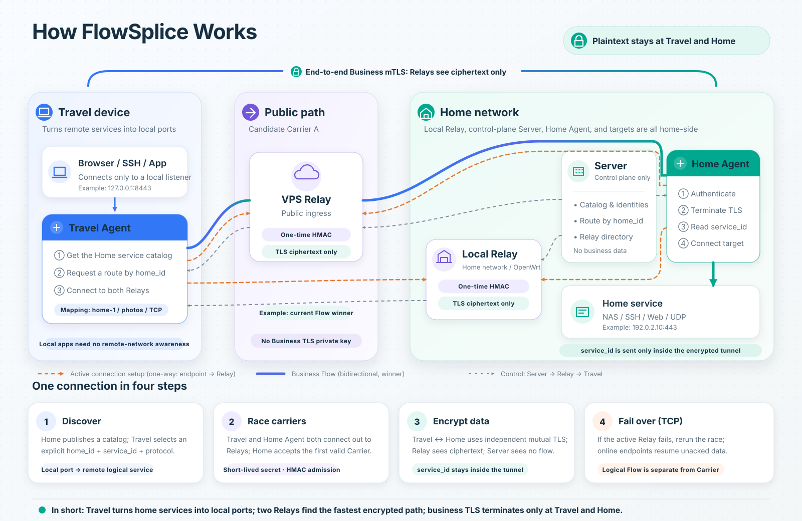

# FlowSplice

FlowSplice is an identity-aware private service access system. It exposes explicitly configured TCP
and UDP services from one or more Home Agents to enrolled Travel devices. Relay forwards the
end-to-end encrypted business stream directly between Travel and Home; Server stays on the control
plane and never binds a business-data listener.

> [!WARNING]
> FlowSplice is under active development and is not generally available. Until a GA release,
> configuration, protocols, persisted state, and deployment artifacts may change without backward
> compatibility.

## How it works



[中文图示](docs/flowsplice-how-it-works.svg)

A local Travel mapping selects one logical business:

```text
(home_id, service_id, protocol) -> local TCP/UDP listener
```

Travel reaches any configured Seed Relay, verifies a Server-signed Relay directory and filtered
service catalog, then races all reachable Relays for each new TCP Flow. The first Carrier to make
progress wins. While Travel and Home remain alive, timeout, reset, EOF, or I/O failure triggers a new
race and the existing TCP Flow can continue over another Relay. Homes are independent businesses,
not interchangeable failover replicas.

## Components

| Component | Responsibility |
| --- | --- |
| `flowsplice-server` | Aggregates Home catalogs, signs Travel-visible control state, coordinates route admission, distributes Travel authorization state, and ingests signed five-minute statistics summaries. |
| `flowsplice-relay` | Provides public management/data ingress and opaque forwarding; Linux builds use `splice(2)` for paired data sockets. |
| `flowsplice-homeagent` | Publishes services, terminates business TLS, connects authorized Flows to local targets, and optionally hosts the local issuer/revocation UI. |
| `flowsplice-travelagent` | Creates local mappings, verifies signed discovery state, races Relays, and originates end-to-end business TLS. |
| `flowsplice-foobar` | Supplies a low-rate loopback target and a single-connection continuity probe for deployment acceptance. |
| `flowsplice-core` | Implements shared framing, authorization, deployment trust, TLS identity, and route admission. |
| `flowsplice-enrollment` | Implements Travel enrollment/import, Home-side issuance, encrypted-key handling, and the offline `flowsplice-trust` utility. |
| `flowsplice-storage` | Provides redb-backed local state, five-minute statistics buckets/outboxes, Relay history, and remote-enrollment inbox/outbox storage. |

The repository is one Rust workspace. The Home and Travel frontends are TypeScript/Vite SPAs
embedded into their Rust executables with
[`embedded-spa`](https://github.com/tomcatzh/embedded-spa/tree/v0.1.1).

## Security model

FlowSplice assumes its source code, protocol, topology, and failure behavior are public. Security is
based on protected private keys, authenticated state, and fresh random secrets—not on hiding the
design.

For the complete rationale, primitive choices, key hierarchy, signed-object fields, verification
order, persistent anti-rollback state, compromise boundaries, and implementation map, see
[Cryptographic design and implementation](docs/cryptography.md).

### Three protection layers

| Layer | Endpoints | Purpose |
| --- | --- | --- |
| Management TLS | Home→Server, Server→Relay, Travel→Relay | Mutual authentication for catalogs, heartbeats, route requests, and short-lived secrets. |
| Route admission | Travel→Relay and Home→Relay data sockets | HMAC-SHA256 proves possession of a single-use route/work secret before Relay pairs the sockets. |
| Business TLS | Travel↔Home through one Relay | End-to-end mutual TLS protects the selected service ID, Flow frames, and business plaintext. |

Management and business identities use separate CA roots. Every leaf certificate carries exactly one
URI identity in the form `flowsplice://identity/<role>/<id>`. TLS chain validation is followed by
role, stable ID, SPKI, authorization scope, and protocol checks. TLS is restricted to TLS 1.3.

### Deployment trust and discovery

- A password-encrypted, offline P-256 deployment root signs a versioned deployment-trust document.
- The document binds both CA roots, Server control-signing key epochs, every Home endpoint's
  management/business SPKIs, and Home/global Travel authorities with their scopes and validity.
- A Travel binary embeds only the deployment-root **public** key. The root private key and password
  are never runtime inputs.
- Home SPKIs are read from verified deployment trust; operators do not repeat them in Server or
  Travel TOML.
- A Seed Relay is an untrusted transport address. Relay IDs and SPKIs are learned from the signed
  control snapshot, not entered as Seed configuration.
- Travel records every Relay from a successfully verified directory as a durable startup candidate.
  A historical record is discovery only: a Relay cannot carry business traffic until Travel obtains
  and verifies a fresh signed snapshot that authorizes it.
- Travel persists deployment/signer epochs, the highest accepted control generation, that
  generation's content hash, and the latest signed snapshot in redb. Rollback, same-generation
  conflicts, future/expired state, and invalid signatures fail closed across restart. A legacy
  `control-trust-state.json` is verified, migrated once, and removed after durable readback.

Server is the final authority for the aggregate Catalog and Relay directory. A compromised certified
Server control key can omit entries, equivocate, or misdirect availability. It still cannot impersonate
a root-bound Home or decrypt end-to-end business TLS. FlowSplice does not currently implement
transparency logs, gossip, witnesses, or quorum detection for Server equivocation.

### Travel authorization

Each Travel installation creates separate management and business P-256 keys locally and encrypts
them with a user password. A Home issuer signs one of three explicit scopes:

- **Service:** one exact `(home_id, service_id, protocol)`;
- **Home:** all current and future services published by one Home;
- **Global:** every Home, using a separately provisioned global authority.

The signed credential binds the Travel ID, both Travel SPKIs, credential ID, authority, scope,
validity, enrollment request/nonce, CA and leaf-certificate hashes, and deployment trust. One
enrollment request can create only one credential. An identical retry returns the original response;
changing scope or validity is rejected, and revocation or expiry never makes the request reusable.

Revocation originates from the Home that owns the signing authority. Server atomically persists the
credential set, revocations, permanently spent enrollment-request fingerprints, and monotonic
authorization generation; Relay and Home durably reject rollback and same-generation conflicts. Issuance and
revocation take effect without restarting Server, Relay, or Home.

Server accepts only the first live process-session UUID for a stable Travel identity. A later process
using copied credentials is rejected while the original renews its lease. This is not theft detection:
if an enrolled device is copied or stolen, revoke every active grant for that identity and enroll new
keys.

### Visibility and limits of confidentiality

| Party | Information available by design |
| --- | --- |
| Travel | Local plaintext, mappings, filtered Catalog, selected Home/service, and Flow state. |
| Home | Published Catalog, selected service, decrypted Flow data, and the final local target. |
| Server | Home/Relay/Travel identities, aggregate catalogs, selected Home ID, and signed five-minute business summaries submitted by nodes; not the business byte stream, plaintext, or selected service ID. |
| Relay | Server/Travel identities, transported Catalog, selected Home ID, timing, and byte volume; not business plaintext or selected service ID. |
| Passive observer | Network endpoints, timing, sizes, and visible TLS metadata; not TLS application plaintext. |

Relay can delay, drop, replay, reorder, or corrupt forwarded business bytes and can deny service.
Server can deny or misdirect new route setup but is not in an established business stream. Business
TLS detects unauthorized modification but cannot force availability. FlowSplice does not
hide traffic metadata or protect plaintext after Travel, Home, or the final service endpoint is
compromised.

For message sequences, trust boundaries, and remaining threat-model detail, see
[Architecture](docs/architecture.md). For the current finding-by-finding security review record, see
[Security audit remediation](docs/security-audit-remediation-2026-08-17.md).

## Build and verification

Required for local checks: stable Rust, Node.js/npm, Python 3, CMake, Clang, and Perl. The E2E suite
also requires Docker and OpenSSL. Cross-platform Linux release builds require Docker Buildx.

```bash
make check
make test
make e2e
```

- `make check` builds both embedded SPAs, validates OpenWrt integration, checks formatting and all
  targets, and runs Clippy with warnings denied.
- `make test` runs the Rust workspace and OpenWrt unit tests.
- `make e2e` creates disposable test PKI and runs two Homes, two Relays, Server, Travel, TCP/UDP
  targets, and both embedded UIs in Docker.

Docker builds reuse local base images and BuildKit cache by default; release and E2E entry points
pass `--pull=false`. Do not refresh base images during ordinary build, test, or deployment work.
Only set `FLOWSPLICE_DOCKER_PULL=true` for an explicitly requested and recorded base-image refresh.

The E2E suite covers encrypted local and authenticated remote enrollment, single-use issuance, three
authorization scopes, live revocation, password rotation, trust-tamper and response-splicing
rejection, durable rollback protection and Relay discovery history, exact multi-Home routing,
one-Seed discovery, duplicate-login rejection, Relay competition, same-TCP-connection handover after
killing the winning Relay, established-flow continuity while Server is stopped, signed statistics
upload/deduplication, and day/week/month/year reports. It also asserts that Server has no business
listener.

E2E keys and logs are written below ignored `tests/e2e/generated/`. They are disposable test data and
must never be used in production. Production logging defaults to `INFO`; component-specific
`RUST_LOG` filters enable Carrier/ACK/DUP diagnostics without logging business payloads, passwords,
private keys, bearer tokens, or route/work secrets.

## Travel Quick Start

Use a deployment-specific Travel binary built with the public deployment root, public management
CA certificate, and at least one bootstrap Relay address embedded. A fresh device does not need a
TOML file or certificate directory before this command:

```bash
mkdir -m 700 ./my-travel
flowsplice-travelagent enroll-remote \
  --travel-id travel-laptop \
  --home-id home-1 \
  --install-dir ./my-travel \
  --tcp foobar=127.0.0.1:10080
```

Enter and confirm a new Travel private-key password of at least 12 characters. Travel creates the
two encrypted private keys locally, contacts the embedded bootstrap Relays using the embedded public
CA, and prints a short Home verification code. The command remains running while it retries and
waits for attended Home approval.

Leave `enroll-remote` running on the Travel machine. On the separate machine that runs Home, open the
issuer page locally at its loopback `ui_listen` address (normally `http://127.0.0.1:9081`). Open the
pending Travel request, compare the verification code, choose the narrowest scope and validity,
click approve, and enter the Home issuer password. No SSH tunnel or remote Home-page access is part
of this workflow. The request and response continue through Relay and Server control connections;
the password is used only on Home and is never sent to Travel, Relay, or Server.

After approval, the waiting Travel verifies and installs the returned trust, dual certificates, and
credential, then atomically creates:

```text
my-travel/travelagent.toml
my-travel/cert/
my-travel/state/travel-state.redb
```

No request or response file is transferred manually. The private keys never leave Travel, and the
generated TOML contains paths and public Relay addresses but no private-key password. Start it:

```bash
flowsplice-travelagent --config ./my-travel/travelagent.toml
```

Enter the same Travel password. The generated mapping and UI bind loopback addresses. The generated
TOML is already complete; edit it only to add another Home or mapping, change local loopback ports,
or tune limits. Do not add Home SPKIs or a full Relay authorization list. TOML Relay entries are
bootstrap addresses only. Travel durably remembers every Relay learned from a verified signed
directory, but after restart it still requires a fresh signed directory before using any Relay for
business.

For a detailed Chinese walkthrough, including recovery and replacement enrollment, see
[Travel Quick Start (简体中文)](docs/QUICK_START.zh-CN.md).

### Test, rotate, replace, and revoke

For a Foobar mapping on `127.0.0.1:10080`:

```bash
flowsplice-foobar probe --addr 127.0.0.1:10080 --count 5
```

The probe sends one exact record every five seconds over one TCP connection and never reconnects, so
handover failures are not hidden by a new connection. See [Foobar](foobar/README.md).

The loopback Home and Travel UIs can change their encrypted private-key passwords. Home re-encrypts
its CA/authority key group; Travel re-encrypts both device private keys. Public keys, certificates,
grants, and active Flows do not change. Passwords are not stored in macOS Keychain or another
password store.

Revoke a credential from the issuing Home UI. Revocation is irreversible. It blocks new authorization
immediately and prevents a revoked Carrier from reattaching; a local TCP socket already waiting for
recovery can remain until Travel's shorter recovery deadline expires.

An already enrolled and authenticated Travel can request replacement enrollment through its local
UI without manually transferring request/response files. The request is relayed over the existing
authenticated control path to the selected Home. A Home operator must still click approval and enter
the issuer password; after the signed response returns, the Travel operator enters the local key
password to install it. Restart activates the replacement identity; the new process confirms
installation to Home, after which both durable lifecycle records are retired.

The older `enroll-init` / Home manual signer / `enroll-import` workflow remains an explicit recovery
path. It is not required by the normal first-device Quick Start.

Travel, Relay, and Home keep only locally observed business metrics in five-minute redb buckets and
serve loopback statistics pages with rolling day/week/month/year report windows. Nodes sign summaries with their
management identity and retry them from a durable outbox. Server certificate-binds and idempotently
deduplicates those summaries; it does not infer business volume from control messages or from a
business forwarding path, because it has no such path.

## Configuration and deployment

All daemons accept `--config <path>` or `FLOWSPLICE_CONFIG`. Server and Relay additionally support
`--check-config` for side-effect-free validation.

- [Server example](server/config.example.toml)
- [Relay example](relay/config.example.toml)
- [Home example](homeagent/config.example.toml)
- [Travel example](travelagent/config.example.toml)

Production operators must provision the signed deployment trust, both CA roots, non-Travel leaf
identities, Server control key, Home authority material, renewal procedure, and the explicit Server
pins used by Home and Relay. Home endpoint SPKIs and Travel authorities live only in the signed
deployment trust; Relay discovery state is signed and learned at runtime.

Only Homes that issue or revoke Travel credentials need an `[issuer]` section and CA/authority
private keys. A secondary Home can omit the section entirely while still publishing services and
accepting credentials whose scope covers it.

The offline deployment-root utility supports encrypted root creation and trust signing:

```bash
flowsplice-trust root-init --output-dir ./deployment-root
flowsplice-trust sign \
  --payload ./deployment-trust-payload.json \
  --root-key ./deployment-root/deployment-root.key \
  --output ./deployment-trust.json
```

Keep the deployment-root private key offline. Renew deployment trust before its validity expires.
Re-signing a higher-generation trust with the same root does not require a new Travel binary;
changing the root public key does.

### OpenWrt

The generic IPK contains Server, multiple named Relay instances, one procd service, UCI rendering,
and a Chinese/English LuCI page. It contains no deployment addresses, credentials, firewall policy,
or private regression tooling. Installation is inert by default and does not create WAN firewall
rules.

Build release binaries first, then the target-matched IPK:

```bash
./scripts/build-release.sh
make openwrt-ipk
```

The default target is `aarch64_generic`. Use the explicit builder arguments documented in
[OpenWrt integration](openwrt/README.md) for another package architecture or version. Confirm the
device ABI and preserve a rollback snapshot before installation.

## Release artifacts

`scripts/build-release.sh` expects `cert/deployment-root.pub` by default. Set
`FLOWSPLICE_DEPLOYMENT_ROOT_PUBLIC_KEY_FILE` to another path. The public key is embedded in the Travel
binary, making that artifact deployment-specific without embedding a signing secret.

The script uses the lockfile and produces:

- `dist/linux-amd64/` — static PIE, musl;
- `dist/linux-arm64/` — static PIE, musl;
- `dist/macos-arm64/` — self-contained arm64 Mach-O executables.

macOS system libraries cannot be fully statically linked, but FlowSplice code and web assets are
contained in single executables. The release builder explicitly applies and verifies free ad-hoc
signatures with stable `io.zxf.flowsplice.*` identifiers (using the reverse-DNS form of the
project owner's `zxf.io` domain) and the hardened runtime. Ad-hoc signing seals
each exact binary but carries no developer identity. Current macOS artifacts are not Developer ID
signed or notarized, so Gatekeeper may block a quarantined download on another Mac. Public distribution should use
[Apple Developer ID signing and notarization](https://developer.apple.com/developer-id/).

## Current limits

- TCP Carrier handover is in memory. Restarting Travel or Home destroys that endpoint socket and ends
  the Flow; a TCP connection cannot be restored across endpoint-process restart. UDP associations do
  not migrate.
- Relay reevaluation starts at 60 seconds and backs off to 15 minutes only while the same Carrier
  remains the winner. A different winner or failure resets the interval.
- A Flow never changes its selected `(home_id, service_id, protocol)` to another Home or service.
- Signed control state protects integrity and rollback, not availability or Server equivocation.
- Unattended signing, automatic certificate renewal, CRL/OCSP, HSM-backed keys, cross-process Flow
  recovery, authenticated automatic updates, and GA compatibility guarantees are not implemented.
- Current release artifacts provide only ad-hoc macOS signing, not Developer ID notarization, update anti-rollback,
  reproducible-build attestation, or published release hashes.
- The project has not undergone a professional third-party security audit and should not be treated
  as a certified security product.

## Repository layout

```text
crates/       shared core, enrollment, and redb storage crates
server/       Server application
relay/        Relay application
homeagent/    Home Agent and issuer UI
travelagent/  Travel Agent and local UI
foobar/       continuity target and probe
openwrt/      UCI, procd, LuCI, and IPK sources
tests/        fixtures and Docker E2E suite
docker/       E2E and release builders
scripts/      release and packaging tools
```

## License

[MIT](LICENSE)
