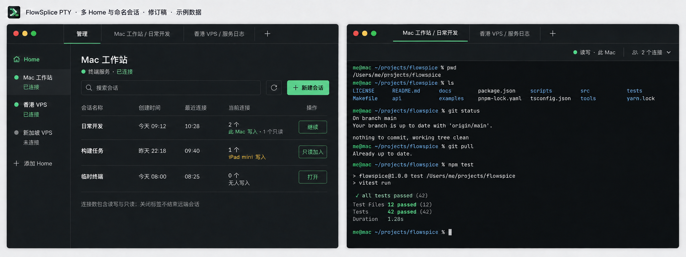
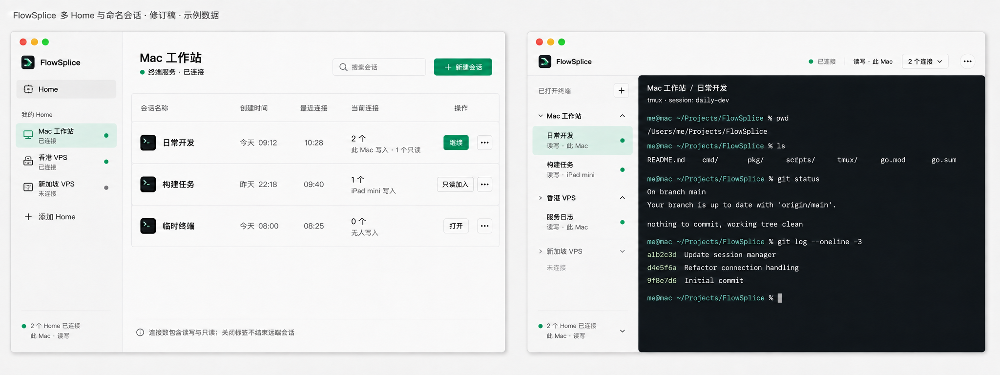
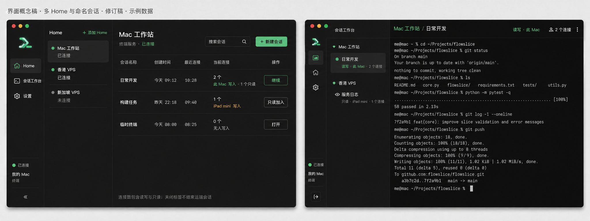
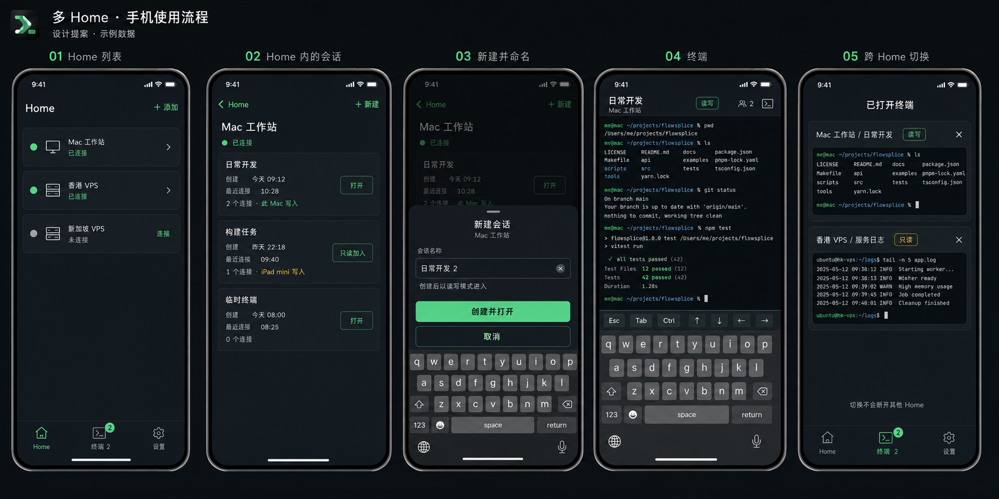
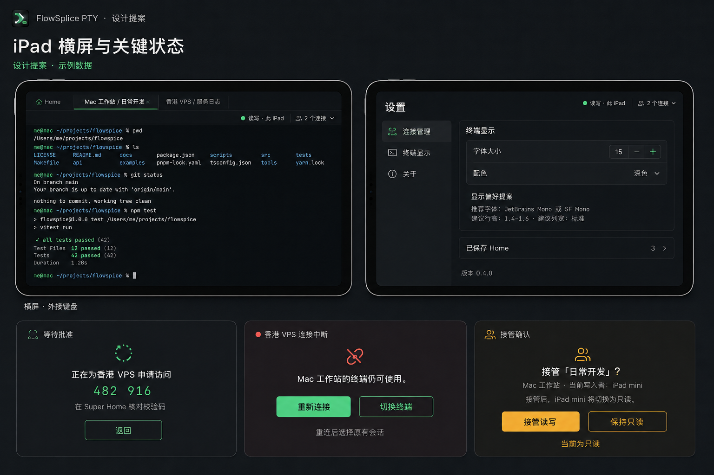

# FlowSplice PTY 界面评估

当前决定：用户已选定 **A 横向标签和手机流程**，并授权开发。请先读[已批准的实现方向](direction-approved.md)；以下内容保留设计评估时的原始说明，不能作为当前实现或验收状态。

这一版已纳入：多 Home 同时连接、会话创建前命名、创建时间、最近连接时间和当前连接数。全部是静态设计提案，应用代码未改。当前功能提交仍为 `9f3b485`，图标提交为 `b02625a`。

## 三种桌面方向

| 方向 | 主要取舍 | 效果图 |
| --- | --- | --- |
| A：横向标签 | 终端面积最大，少量到中等数量终端切换直接；标签很多时需补切换器 | [桌面 A](a-desktop-v2.png) |
| B：原生分栏 | 浅色管理与深色终端，Home 层次清楚；侧栏占据更多宽度 | [桌面 B](b-desktop-v2.png) |
| C：会话工作台 | 按 Home 分组的纵向列表，多会话上下文更明确；更高密度 | [桌面 C](c-desktop-v2.png) |

## 手机和 iPad 的页面流程

[手机五页](mobile-v2.png)：Home 列表 → Home 内会话 → 创建并命名 → 终端 → 跨 Home 切换。

[iPad 与状态](ipad-v2.png)：横屏终端、独立设置、按 Home 等待批准、单个 Home 断线、读写接管。

## 评估重点

先评估页面组织、终端面积、同时打开多个 Home 时的辨识性，以及手机键盘出现后的可操作性，再决定颜色和间距。A/B/C 可取长补短，目前没有选定方向。

这几项新增能力尚未实现。创建时间已有协议字段，其余会话元数据和多 Home 的应用管理需在后续开发中补齐。效果板使用示例数据；涉及状态标签的次要图像偏差以[设计规格](design-spec.md)为准，不能据此推断后端行为。

[完整设计规格](design-spec.md) · [Termius 研究](research.md) · [品牌输入](brand-spec.md) · [全部提示词](prompts.json)

图像由内置 image_gen 生成并人工审图；没有使用 CLI 回退，没有生成应用实现代码。文件像素尺寸以 PNG 本身为准，提示词中期望的尺寸不作为验收声明。`initial-v1/` 是多 Home 补充前的旧稿，已被本修订取代。
