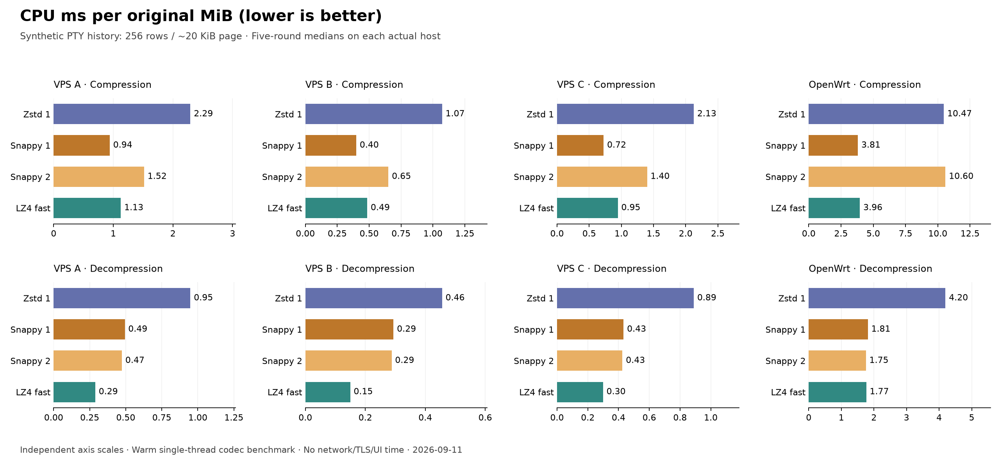

# 三台 VPS + OpenWrt：压缩速度与 CPU 实测

2026-09-11，四台实际设备已完成。每台 20 组内容 × 10 个配置 × 压缩／解压 × 5 轮，四机合计 **8,000 个计时阶段**；800 个设备／内容／算法组合均完成计时前后逐块解压校验。

**以速度和 CPU 为先，优先考虑 Snappy 1 或 LZ4 fast。** 普通历史页和 4 KiB 终端输出，四台机器上都是 Snappy 1 的压缩中位吞吐更高；96 KiB 历史和真实源码则是 LZ4 fast 的中位吞吐更高。LZ4 fast 通常还明显节省解压 CPU。Zstd 1 是多花 CPU 换更少传输量的候选。Snappy 2 在 OpenWrt 上的压缩成本尤其高，不建议作为通用默认。这里提出候选，尚未把任何算法接入产品。

## 1. 四组硬件与运行条件

VPS A／B／C 是固定匿名标签，真实管理地址不放入代码或公开结果。CPU 型号是虚拟机报告值；VPS B 型号名称中的 96-Core 不代表它有 96 个可用核心。

| 机器 | 报告的 CPU／板型 | 可用逻辑核 | 系统 | 测试秒数 | 测试峰值内存 |
|---|---|---:|---|---:|---:|
| VPS A | Xeon Platinum 8269CY | 1 | Ubuntu 22.04.5 LTS | 265 | 95.2 MiB |
| VPS B | EPYC 9655P | 1 | Ubuntu 22.04.5 LTS | 252 | 95.1 MiB |
| VPS C | EPYC-Milan | 1 | Ubuntu 26.04.1 LTS | 260 | 95.2 MiB |
| OpenWrt | NanoPi R5C · ARM64 | 4 | OpenWrt 24.10.2 | 355 | 95.0 MiB |

官方实现：Zstd **1.5.7**（-3、1、3、6、9），Google Snappy **1.2.2**（1、2），LZ4 **1.10.0**（fast、HC9），另有 memcpy 基线。三台 VPS 运行同一个静态 x86-64 可执行文件，OpenWrt 使用静态 ARM64 文件；性能数据均来自远端实际运行。

所有机器：单线程、Release、同一份冻结样本、独立块、复用缓冲区；每阶段预热后连续运行至少 120 ms，各阶段随机打乱，共五轮，取每项中位数。低优先级 nice 10，进程地址空间上限 256 MiB；不绑核、不调整系统调频。OpenWrt 保持原有 conservative 调频，上报最高频率约 1.992 GHz。

峰值内存是整个测试进程的 RSS，包含冻结样本、结果和缓冲区；它不是各算法单独的内存需求比较。

## 2. 普通历史页：速度

样本为生成的多字段日志，256 行／页、约 20 KiB，按当前 History JSON 消息体组织，16 页独立压缩。不是从个人 tmux 采集的历史。

每格为 **压缩 / 解压 MiB/s**，越高越快；两者都按原始字节数计算，1 MiB = 1,048,576 字节。

| 机器 | Zstd 1 | Snappy 1 | Snappy 2 | LZ4 fast |
|---|---:|---:|---:|---:|
| VPS A | 434.9 / 1,052.6 | 1,054.8 / 2,021.5 | 657.0 / 2,106.7 | 886.2 / 3,456.2 |
| VPS B | 932.6 / 2,187.4 | 2,505.8 / 3,396.0 | 1,533.4 / 3,470.8 | 2,058.0 / 6,647.0 |
| VPS C | 469.4 / 1,119.6 | 1,370.7 / 2,302.4 | 713.2 / 2,341.5 | 1,052.4 / 3,332.0 |
| OpenWrt | 95.4 / 238.3 | 262.4 / 551.1 | 94.3 / 569.9 | 252.1 / 566.1 |

## 3. 相同工作量消耗多少 CPU

连续压测会一直给算法喂数据，所以这些组合的 CPU 占用都接近一个核心的 100%；不能据此说它们一样省 CPU。真正可比的是处理相同原始数据需要多少 CPU 时间。

下表每格为 **压缩 / 解压 CPU ms/MiB**，越低越省 CPU。

| 机器 | Zstd 1 | Snappy 1 | Snappy 2 | LZ4 fast |
|---|---:|---:|---:|---:|
| VPS A | 2.293 / 0.949 | 0.941 / 0.494 | 1.517 / 0.473 | 1.126 / 0.289 |
| VPS B | 1.072 / 0.456 | 0.399 / 0.294 | 0.651 / 0.288 | 0.485 / 0.150 |
| VPS C | 2.127 / 0.890 | 0.725 / 0.433 | 1.401 / 0.425 | 0.946 / 0.299 |
| OpenWrt | 10.469 / 4.196 | 3.811 / 1.814 | 10.597 / 1.755 | 3.964 / 1.766 |

对应的实测占用率如下，每格为 **压缩 / 解压 %**。100% 表示一个逻辑核；在四核 OpenWrt 上约相当于整机计算容量的四分之一。

| 机器 | Zstd 1 | Snappy 1 | Snappy 2 | LZ4 fast |
|---|---:|---:|---:|---:|
| VPS A | 99.7 / 99.8 | 99.8 / 99.8 | 99.7 / 99.8 | 99.8 / 99.8 |
| VPS B | 99.9 / 99.8 | 99.9 / 99.9 | 99.9 / 99.9 | 99.9 / 99.9 |
| VPS C | 99.5 / 99.6 | 99.6 / 99.5 | 99.7 / 99.6 | 99.6 / 99.7 |
| OpenWrt | 99.9 / 99.9 | 100.0 / 100.0 | 100.0 / 100.0 | 99.9 / 100.0 |

CPU 时间通过进程 user + system 时间测量，占用率 = CPU 时间 / 墙钟时间。各项中位数独立计算，不应要求两个中位数相除严格等于另一个中位数。[getrusage 定义](https://man7.org/linux/man-pages/man2/getrusage.2.html)

例如 OpenWrt 若持续压缩 10 MiB/s 的这类历史，线性换算的单核 CPU 占用约为：

| 算法 | 估算单核 CPU 占用 |
|---|---:|
| Zstd 1 | 10.47% |
| Snappy 1 | 3.81% |
| Snappy 2 | 10.60% |
| LZ4 fast | 3.96% |

这是由实测 CPU ms/MiB 推算的 **固定速率估计**，不是另一次限速运行结果。公式为 `CPU% = CPU ms/MiB × MiB/s ÷ 10`；不包含传输、加密、序列化、调频唤醒和 UI 成本。

## 4. Snappy Level 2 的实际代价

下面是普通历史页中 Level 2 相对于 Level 1 的变化：

| 机器 | 压缩 CPU 时间倍数 | 解压速度变化 |
|---|---:|---:|
| VPS A | 1.61× | +4.2% |
| VPS B | 1.63× | +2.2% |
| VPS C | 1.93× | +1.7% |
| OpenWrt | 2.78× | +3.4% |

四台机器的压后字节数一致：Level 2 对本组历史仅再减少 **1.03%**。OpenWrt 付出约 2.8 倍压缩 CPU，换来的解压速度差只有几个百分点；小幅速度变化还应考虑波动。真实源码中 Level 2 额外缩小约 8.9%，取舍更合理，但 OpenWrt 的压缩 CPU 仍约为 Level 1 的 2.2 倍。

测试明确调用官方 Level 2，不是默认 Level 1。官方 1.2.2 头文件仍将 Level 2 标为 experimental；官方通用收益不能替代此处逐内容实测。[Snappy 1.2.0 发布说明](https://github.com/google/snappy/releases/tag/1.2.0)、[1.2.2 接口](https://github.com/google/snappy/blob/1.2.2/snappy.h)

## 5. 更换内容后，结论会变

真实 Rust 源码，独立 96 KiB 块；每格仍为 **压缩 / 解压 MiB/s**：

| 机器 | Zstd 1 | Snappy 1 | Snappy 2 | LZ4 fast |
|---|---:|---:|---:|---:|
| VPS A | 306.4 / 1,017.8 | 413.0 / 1,426.2 | 310.8 / 1,664.8 | 452.2 / 2,688.0 |
| VPS B | 523.9 / 2,044.1 | 698.5 / 2,158.6 | 527.3 / 2,576.5 | 744.5 / 4,887.9 |
| VPS C | 325.9 / 1,131.2 | 429.9 / 1,598.4 | 320.7 / 1,865.6 | 508.5 / 2,861.0 |
| OpenWrt | 67.0 / 227.6 | 130.1 / 437.1 | 60.3 / 496.4 | 132.8 / 557.6 |

接近 96 KiB 的生成历史页；每格为 **压缩 / 解压 CPU ms/MiB**：

| 机器 | Zstd 1 | Snappy 1 | Snappy 2 | LZ4 fast |
|---|---:|---:|---:|---:|
| VPS A | 1.947 / 0.809 | 1.227 / 0.428 | 1.749 / 0.418 | 1.127 / 0.225 |
| VPS B | 0.899 / 0.359 | 0.597 / 0.279 | 0.862 / 0.281 | 0.590 / 0.125 |
| VPS C | 1.747 / 0.727 | 1.279 / 0.387 | 1.784 / 0.387 | 0.961 / 0.232 |
| OpenWrt | 10.036 / 3.769 | 4.759 / 1.591 | 11.755 / 1.577 | 4.561 / 1.504 |

4 KiB 生成终端原始字节；每格为 **压缩 / 解压 MiB/s**：

| 机器 | Zstd 1 | Snappy 1 | Snappy 2 | LZ4 fast |
|---|---:|---:|---:|---:|
| VPS A | 388.5 / 894.8 | 1,829.9 / 1,810.3 | 1,052.7 / 1,797.4 | 1,446.2 / 6,041.2 |
| VPS B | 819.3 / 1,781.6 | 3,578.9 / 3,383.8 | 2,344.6 / 3,384.1 | 2,827.7 / 11,626.1 |
| VPS C | 422.2 / 949.7 | 1,994.8 / 2,153.3 | 1,152.8 / 2,147.0 | 1,541.6 / 6,174.1 |
| OpenWrt | 81.5 / 206.7 | 402.7 / 582.8 | 158.3 / 578.2 | 235.1 / 966.9 |

这些样本支持保留 Snappy 1 与 LZ4 fast 两个 CPU 优先候选，不能宣布其中一个对所有内容都更快。其余 Markdown、中英文、ANSI 重绘、JSON、短消息、PNG、伪随机内容均保留在每台机器的完整表格中。

## 6. 高等级压缩：OpenWrt 的发送端成本

普通历史页，全部配置如下。压后体积只用于解释 CPU 换到了什么；这次重点仍是速度与 CPU。

| 算法 | 压后占原文 | 压缩 MiB/s | 解压 MiB/s | 压缩 CPU ms/MiB | 解压 CPU ms/MiB |
|---|---:|---:|---:|---:|---:|
| none-copy | 100.00% | 4775.8 | 4789.4 | 0.208 | 0.209 |
| zstd-fast3 | 21.55% | 125.3 | 283.0 | 7.980 | 3.524 |
| zstd-1 | 11.07% | 95.4 | 238.3 | 10.469 | 4.196 |
| zstd-3 | 13.18% | 55.6 | 231.2 | 17.950 | 4.314 |
| zstd-6 | 11.75% | 17.6 | 232.7 | 56.743 | 4.296 |
| zstd-9 | 11.42% | 9.4 | 250.5 | 106.781 | 3.992 |
| snappy-1 | 24.32% | 262.4 | 551.1 | 3.811 | 1.814 |
| snappy-2 | 24.07% | 94.3 | 569.9 | 10.597 | 1.755 |
| lz4-fast | 28.00% | 252.1 | 566.1 | 3.964 | 1.766 |
| lz4-hc9 | 24.11% | 11.2 | 796.1 | 89.563 | 1.255 |

Zstd 6／9、LZ4 HC9 在 OpenWrt 上的压缩 CPU 成本明显高于快速候选。普通历史页中高等级 Zstd 还没有压得比 Level 1 更小。已压缩或伪随机数据的体积收益有限，压完再回退也无法收回已经花掉的 CPU。是否压缩仍应由 PTY 业务根据载荷决定。

## 7. 可信范围、构建与运行复核

- 全部四机共 800 组合、8,000 计时阶段完成；每块计时前后均逐字节校验。20 组样本哈希和 200 个压后大小在四台设备及原 Mac 基线间一致。没有采集个人终端内容。
- 编译器 Rust 1.97.1、GCC/G++ 15.2.0；C/C++ 使用 O3。x86 库使用三台 VPS 均已核实支持的 x86-64-v3 基线；ARM64 使用 armv8-a+crc，Snappy NEON/CRC 路径启用。静态 musl/C++ 链接，没有动态加载器或外部共享库依赖。构建容器只用于构建与正确性冒烟，其计时不计入本报告。
- 每种架构 4 项 Release 测试及 200 组合冻结样本冒烟通过。源码、上游归档、原生静态库和最终可执行文件哈希见构建清单。目标设备无需安装编译器或依赖。
- 前后服务观察列表一致（VPS A/B/C 为 31/27/26 个；OpenWrt 为 11 个相关服务进程，不含 SSH 会话子进程）。只执行临时测试，没有修改生产配置、身份、证书、服务或调频设置。所有四机专用临时目录已清理；前后快照不等于持续可用性监测。
- VPS C 的原始 SSH 控制连接最终返回 255，但远端完整结果、退出码 0 和归档已通过另一条连接取回验证；没有把传输连接错误当作成功测试，也没有拿不完整计时补结果。
- 所有吞吐均为预热、内存内、单线程算法性能；不包含 JSON 编解码、网络、TLS、磁盘、冷启动和终端渲染。LZ4 为原始块（原文长度在外），Snappy 为 raw，Zstd 为独立 frame；额外应用封装没有计入。
- Linux 使用低内存 schema 2：每阶段在计时外创建并预热一个上下文。原 Mac 基线为 schema 1，保留原始记录；没有用新数据覆盖它，也不把两次方法差异当作硬件结论。
- 非独占系统，以下相对 MAD 是五轮速度的描述性波动，不是置信区间。几个百分点的速度差不能作为强结论；CPU 占用不等于功耗。

| 机器 | 400 项速度相对 MAD：中位数 | 95 分位 | 全程 CPU steal |
|---|---:|---:|---:|
| VPS A | 0.47% | 3.65% | 0.000% |
| VPS B | 0.63% | 2.06% | 0.012% |
| VPS C | 1.42% | 3.85% | 0.008% |
| OpenWrt | 0.35% | 2.25% | 0.000% |

iOS／Android 继续只考虑解压。官方解码库和 Rust 调用路径的交叉编译／链接已经验证，但本次 OpenWrt ARM64 结果不代表 iPad 或 Android 手机性能；没有将编译通过写成真机性能通过。详情见 [移动端构建边界](../../CROSS_COMPILE.md)。

## 8. 选择建议与完整数据

| 你的优先目标 | 候选 | 本次四机证据 |
|---|---|---|
| Home 端处理常见终端输出和普通历史尽量轻 | **Snappy 1** | 这两类样本在四机上压缩最快；OpenWrt 普通历史仅 3.81 CPU ms/MiB |
| 更低解压成本，同时兼顾复杂大块内容 | **LZ4 fast** | VPS 解压优势大；96 KiB 历史和源码压缩也胜 Snappy 1；OpenWrt 普通历史解压与 Snappy 接近 |
| 愿意多花 CPU 减少历史传输量 | **Zstd 1** | OpenWrt 普通历史压缩 10.47 CPU ms/MiB；体积为原文 11.07%，Snappy 1 为 24.32% |
| 固定使用 Snappy，愿意加重编码换体积 | Snappy 2 | 源码有收益，普通历史收益小；OpenWrt 成本偏高，应按内容选择 |

现在若只按速度和 CPU 决策，我会把 **Snappy 1、LZ4 fast 放在第一组**，Zstd 1 留作流量优先选项。最终算法、阈值和协议仍由你选择；通用 FlowSplice 加密传输层没有引入自动压缩策略。

- 四组完整数据：[VPS A 的全部 200 项](vps-a/measurements.zh-CN.md)；[VPS B 的全部 200 项](vps-b/measurements.zh-CN.md)；[VPS C 的全部 200 项](vps-c/measurements.zh-CN.md)；[OpenWrt 的全部 200 项](openwrt/measurements.zh-CN.md)。
- 每组目录均含 `results.json`（所有轮次、块延迟与哈希）、`summary.csv`、`run.log`、`host.json` 和退出码。
- [四机硬件与负载](hosts.json)、[x86-64 构建清单](amd64-build.json)、[ARM64 构建清单](arm64-build.json)、[复核与清理收据](verification.json)。
- [Rust 基准程序](../../src/main.rs)、[冻结样本读写](../../src/frozen.rs)、[内容来源](../../CORPUS.md)、[运行方法](../../README.md)、[静态 Linux 构建方法](../../BUILD_LINUX.md)。
- [原 Mac 报告](../2026-09-11-m4-max/REPORT.zh-CN.md) 保留为历史基线；此次四机结果补足其未测 Linux 的边界。
