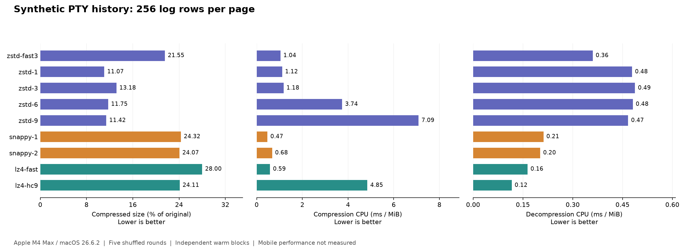
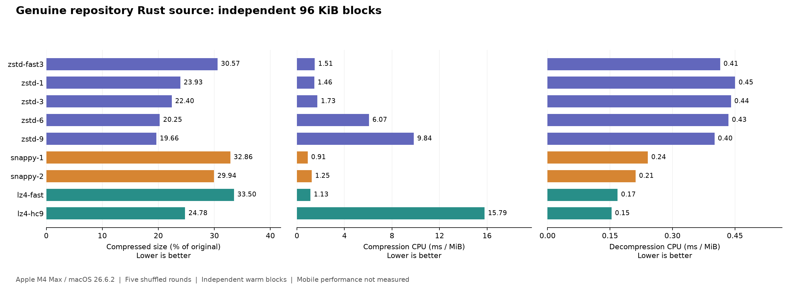

# FlowSplice PTY 压缩算法实测报告

日期：2026-09-11。基于产品源码 `165c133`，新增独立 Rust 基准程序；产品协议、业务逻辑、通用传输层和依赖均未改变。

**建议先把 Zstd 1 和 LZ4 fast 留作两个主要候选：前者优先节省流量，后者优先降低客户端解压开销。** Snappy 1 的压缩速度也有优势；Snappy 2 的收益取决于内容，不适合仅依据官方通用比例直接选定。移动端只考虑解压，最终默认值仍需候选算法的真机验证。本报告尚未替产品选定或接入算法。

本次完成 **20 组内容 × 10 个配置 × 压缩／解压 × 5 轮 = 2,000 个计时阶段**，另有每方向每组合 512 次块耗时探测。200 个组合中的每一块在计时前后均逐字节往返验证成功。

## 1. 测试条件与指标

| 项目 | 实测条件 |
|---|---|
| 机器 | Apple M4 Max，16 核，128 GiB 内存，接通电源 |
| 系统 | macOS 26.6.2，arm64 |
| 编译 | Rust 1.97.1 Release；原生库 Apple Clang 21.0.0、`-O3 -DNDEBUG`；Snappy NEON 路径启用 |
| 版本 | 官方 Zstd 1.5.7；官方 Google Snappy 1.2.2；官方 LZ4 1.10.0，源码压缩包 SHA-256 固定 |
| 配置 | Zstd -3／1／3／6／9；Snappy 1／2；LZ4 fast／HC9；不压缩 memcpy 基线 |
| 方式 | 单线程、内存内、预热后，每块独立；复用输出缓冲和编解码上下文，没有跨块字典 |
| 重复 | 五轮，各轮随机打乱全部组合及方向；每阶段至少 120 ms，报告中位数 |
| 时长 | 核心测试约 250 秒，不含构建、样本准备和报告生成 |
| 背景负载 | 非独占系统，未绑定核心；开始／结束 1 分钟负载约 4.21／4.85 |

“压后占原文”越低越省流量，例如 11% 意味着约节省 89%；“压缩比”另定义为原文大小÷压后大小，越高越好。速度一律以**原始 MiB/s**计，解压也使用解压后的字节数作为分子。1 MiB = 1,048,576 字节。

CPU 占用率为 `进程用户态+内核态 CPU 时间 / 墙钟时间 × 100%`，通过 `getrusage` 实测；**100% 表示占满一个核心，不是占满整机**。连续饱和压测的占用率自然接近 100%，所以同时记录 **CPU ms/MiB**，用于比较完成同样工作所需的 CPU 时间。它不能直接当作手机功耗或电量消耗。

库输出大小不包含应用封装、额外长度字段和 TLS 开销。Zstd 输出独立 frame，Snappy raw 自带原文长度，LZ4 为 raw block、原文长度由测试程序提供；小消息不能忽略这些格式差异。JSON 编码、网络、界面渲染、磁盘、冷启动和设备唤醒均未计入。

五轮速度的相对中位绝对偏差，在 400 个“组合×方向”中：中位数约 **1.17%**，95 分位约 **5.27%**，最大约 **12.48%**。因此几个百分点的速度差应谨慎解释；这是描述性波动指标，不是置信区间。

## 2. 普通历史页：256 行，约 20 KiB／页

以下是**生成的、多字段变化的日志历史**，不是用户真实 tmux 历史。16 页分别压缩；有模板重复性，不能把这些比例直接当作全部生产流量的节省比例。

| 算法 | 压后占原文 | 压缩 MiB/s | 解压 MiB/s | 压缩 CPU ms/MiB | 解压 CPU ms/MiB |
|---|---:|---:|---:|---:|---:|
| Zstd -3 | 21.55% | 959 | 2,771 | 1.043 | 0.360 |
| **Zstd 1** | **11.07%** | **895** | **2,089** | **1.117** | **0.479** |
| Zstd 3 | 13.18% | 850 | 2,049 | 1.177 | 0.488 |
| Zstd 6 | 11.75% | 267 | 2,079 | 3.743 | 0.481 |
| Zstd 9 | 11.42% | 141 | 2,141 | 7.089 | 0.467 |
| Snappy 1 | 24.32% | 2,115 | 4,713 | 0.473 | 0.212 |
| Snappy 2 | 24.07% | 1,473 | 4,945 | 0.678 | 0.202 |
| **LZ4 fast** | **28.00%** | **1,706** | **6,060** | **0.586** | **0.164** |
| LZ4 HC9 | 24.11% | 206 | 8,543 | 4.846 | 0.116 |

这些配置的压缩／解压 CPU 占用率中位数均约 99.9%–100.0%；这是单核连续压测的正常结果，差异体现在上表的单位工作 CPU 时间。

对这个样本，Zstd 1 的压后体积比 Snappy 2 小约 **54%**。它在 Mac 上的解压 CPU 成本也更高：每 MiB 0.479 ms，对比 Snappy 2 的 0.202 ms 和 LZ4 fast 的 0.164 ms。是否值得这项交换，应结合移动端实测和网络条件决定。

## 3. 真正的仓库源码：独立 96 KiB 块

这是仓库 `crates/` 中按路径排序的真实 Rust 文件，自然切块，没有重复文件填充。它提供比生成日志更复杂的对照。

| 算法 | 压后占原文 | 压缩 MiB/s | 解压 MiB/s | 压缩 CPU ms/MiB | 解压 CPU ms/MiB |
|---|---:|---:|---:|---:|---:|
| Zstd 1 | 23.93% | 686 | 2,219 | 1.457 | 0.451 |
| Zstd 3 | 22.40% | 578 | 2,270 | 1.731 | 0.440 |
| Zstd 6 | 20.25% | 165 | 2,299 | 6.067 | 0.435 |
| Zstd 9 | 19.66% | 102 | 2,477 | 9.838 | 0.401 |
| Snappy 1 | 32.86% | 1,098 | 4,151 | 0.911 | 0.241 |
| Snappy 2 | 29.94% | 799 | 4,726 | 1.250 | 0.211 |
| LZ4 fast | 33.50% | 882 | 5,933 | 1.134 | 0.168 |
| LZ4 HC9 | 24.78% | 63 | 6,486 | 15.788 | 0.154 |

这里 Zstd 3 比 Level 1 再减少约 6.4% 的压后体积；Snappy 2 的优势也比普通历史页明显。LZ4 HC9 能以较低的解压开销获得更紧凑的数据，但压缩成本很高。不能只看解压速度而忽略 Home 端代价。

## 4. Snappy Level 2 是否值得

测试调用的是 `snappy::RawCompress(..., CompressionOptions{2})`，由 C ABI 桥接进入 Rust；没有用默认 Level 1 或其他 Rust 算法代替。官方 1.2.0 确实加入了 Level 2，1.2.2 头文件仍标为 experimental。[官方发布说明](https://github.com/google/snappy/releases/tag/1.2.0)、[1.2.2 接口](https://github.com/google/snappy/blob/1.2.2/snappy.h)

下表均为 Level 2 相对 Level 1。体积改善按**两者压缩后字节数**比较，CPU 增加按每 MiB CPU 时间比较。

| 内容 | 压后体积减少 | 压缩 CPU 时间增加 | 解压速度变化 |
|---|---:|---:|---:|
| 普通 256 行历史页 | 1.03% | 43.5% | +4.9% |
| 接近 96 KiB 的历史页 | 0.44% | 47.7% | +1.4% |
| 真实 Rust 源码 96 KiB 块 | 8.89% | 37.2% | +13.9% |
| 4 KiB 生成终端原始字节 | 1.59% | 43.2% | -3.1% |
| 相同终端内容的当前 JSON | 11.18% | 11.7% | +14.9% |

**不能假定 Level 2 总能多压 5%–10%，或总能更快解压。** 小幅解压速度差还可能落在测量波动内；体积差是确定的。官方比例是其测试条件下的概括，本项目应依据自己的内容选择。

## 5. 小消息、不可压缩内容和现有 JSON

1 字节按键在本次独立块测试中，Zstd 输出 10 字节，Snappy 输出 3 字节，LZ4 输出 2 字节，尚未加应用封装。8 字节消息也都变大；64 字节命令片段整体没有获得净体积收益。这支持对按键和小控制消息保留不压缩路径。

96 KiB 伪随机数据在所有配置下都略微膨胀；真实 PNG 分块仅缩小约 0.8%–1.2%。尤其 LZ4 HC9 对随机数据仍花费约 **11.37 CPU ms/MiB**，没有换到体积收益。已知压缩内容应由业务直接跳过压缩，不能指望“压完再回退”消除已经花掉的 CPU 时间。

相同的 4,096 字节终端内容，当前数字数组 JSON 平均为 **14,472.5 字节**，约原来的 3.53 倍。压缩能部分抵消这项开销，但没有全部抵消：

| 编码／算法 | 原始终端字节压后的平均大小 | 当前 JSON 压后的平均大小 |
|---|---:|---:|
| 不压缩 | 4,096 B | 14,472.5 B |
| Zstd 1 | 523.7 B | 769.5 B |
| Zstd 3 | 501.2 B | 810.0 B |
| Snappy 1 | 890.8 B | 1,798.2 B |
| Snappy 2 | 876.6 B | 1,597.2 B |
| LZ4 fast | 888.4 B | 1,667.7 B |

这里比较绝对字节数，避免把 JSON 较大的分母造成的“更高压缩率”误认成最终流量更少。紧凑载荷编码值得单独设计；本次没有修改协议，也没有测 JSON 序列化／解析耗时。

## 6. 更强压缩与移动端范围

接近 96 KiB 的生成历史页中，Zstd 9 把原文压至 8.75%，Zstd 1 为 10.67%，即额外减少约 18% 的压后字节。但压缩 CPU 成本由 **0.818 增至 6.087 ms/MiB，约 7.4 倍**。普通历史页则是 Zstd 1 压得更小。更高等级不是所有内容都更划算，也不应仅因发送端是 Mac 就自动上高等级。

移动端只需解压；本机 Mac 解压测量用于算法比较，**不是 iPad／Android 性能结果**。已经用现有工具链完成以下官方解压库及 Rust 调用链接检查：

| 目标 | 工具链 | 已完成 | 未完成 |
|---|---|---|---|
| iOS 真机 arm64 | iPhoneOS SDK 26.5，最低 iOS 17 | 三种库交叉编译；Rust → C ABI → 解压函数链接 | 真机运行与性能 |
| iOS 模拟器 arm64 | iPhoneSimulator SDK 26.5，最低 iOS 17 | 同上，平台类型检查通过 | 模拟器运行 |
| Android arm64-v8a | NDK r29，API 34 | 同上，ELF AArch64 链接通过 | 真机运行与性能 |

最终移动端链接探针仅调用解压函数，没有压缩或压缩上下文创建调用。完整上游静态库仍包含编码器代码；这里只证明解压使用路径可编译链接，不承诺最终裁剪体积、Swift/JNI 完整集成或商店交付已完成。三平台符号检查均已保存。Linux ARM64／AMD64 性能未在本次测量。

详细构建边界和复现步骤见 [交叉编译说明](../../CROSS_COMPILE.md)。下一步如果需要真机，应只测试选出的候选解码器、实际历史页输入和连续加载时的界面响应；届时再请求设备配合。

## 7. 供选择的方案

| 优先目标 | 建议候选 | 根据与取舍 |
|---|---|---|
| 减少 PTY 历史与文本传输量 | **Zstd 1** | 本次历史样本明显更小，Home 压缩开销适中；客户端解压成本高于 Snappy／LZ4 |
| 尽量轻的移动端解压 | **LZ4 fast** | 本次解压快、单位 CPU 成本低，编码端代价也低；通常需要传更多字节 |
| 尽量快的 Home 压缩 | **Snappy 1** | 普通历史、源码和终端样本中压缩吞吐有优势；压后体积高于 Zstd |
| Home 多做一些工作，换较紧凑 Snappy 数据 | **Snappy 2** | 对真实源码及当前 JSON 有收益；对本组历史页额外收益很小 |
| 特别受限的带宽、大块内容 | Zstd 3／6／9 | 需按实际内容评估，部分场景节省更多，压缩成本增加；不建议直接设为所有消息的默认 |
| 压一次、多次解压且 Home 不急 | LZ4 HC9 可保留研究 | 部分样本解压很快，但压缩成本高，本次不推荐作为普通实时 PTY 默认 |

我的建议是先在 **Zstd 1 与 LZ4 fast** 中做最终取舍，保留 Snappy 1／2 作为明确偏好其取舍时的选择。压缩策略继续由 PTY 业务决定，FlowSplice 通用传输层不感知算法或内容。

## 8. 文件与复现证据

- [Rust 测试／基准入口](../../src/main.rs)，[确定性样本生成器](../../src/corpus.rs)，[运行说明](../../README.md)，[完整样本来源](../../CORPUS.md)。
- [全部 20 组、200 组合的表格](measurements.zh-CN.md)，[CSV](summary.csv)，[每轮原始数据与样本哈希](results.json)。
- [机器、构建及源码／二进制哈希](environment.json)，[原生库版本、来源、哈希和构建命令](native-build.json)，[完整计时进度](run.log)。
- [移动端交叉编译／链接记录](cross-build.json)，[三平台仅解压符号复核](decoder-symbol-checks.json)。

结果来自上述版本与样本；不代表全部真实终端内容、手机电量、Linux VPS 性能或端到端网络收益。本次没有读取个人会话历史，没有更新应用或生产环境。
